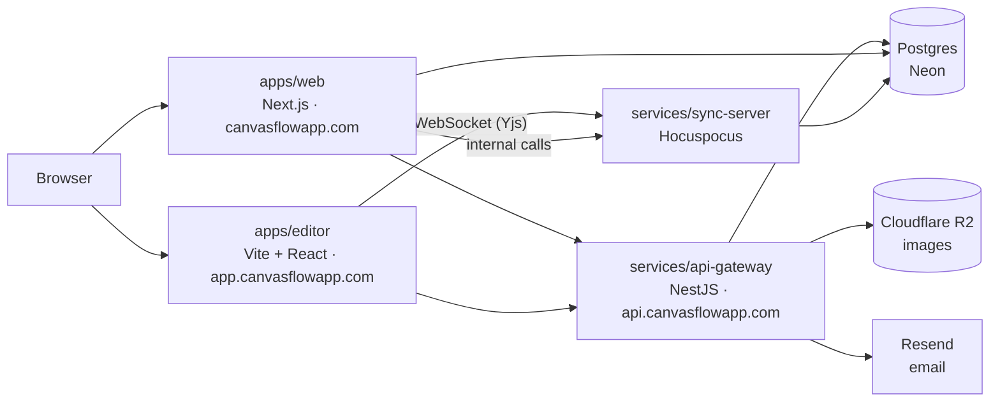

# CanvasFlow

[](https://github.com/Moxsahil/canvasflow/actions/workflows/ci.yml)

A collaborative whiteboard. Sketch diagrams on an infinite canvas, and edit the
same board with other people in real time, with live cursors.

Live at [canvasflowapp.com](https://canvasflowapp.com).

## Features

- **Canvas**: rectangles, diamonds, ellipses, arrows (bound to shapes, with
  labels), lines, freehand drawing, text, images and frames, drawn in a
  hand-sketched style. Selection, snapping, undo, the eraser and a laser
  pointer for presenting.
- **Real-time collaboration**: boards sync through Yjs, so edits from everyone
  merge without conflicts, with live cursors and presence. Boards keep working
  offline and catch up when the connection returns.
- **Sharing**: workspaces, board members with owner, editor and viewer roles,
  share links, and guests who join by link without an account.
- **Files**: export to PNG or SVG, copy to the clipboard, and save or open
  `.canvasflow` board files.
- **Editor**: a command palette, search across the board, focus and view-only
  modes, and light and dark themes.
- **Accounts**: email and password, Google or GitHub, email verification,
  password recovery by email link, and sessions that can be ended everywhere at
  once.

## How it fits together



| Part                     | What it does                                                                                                 |
| ------------------------ | ------------------------------------------------------------------------------------------------------------ |
| `apps/web`               | Marketing site, sign-in and sign-up pages, password recovery, invites, and the workspace and sharing APIs.   |
| `apps/editor`            | The canvas application. Runs on its own origin and holds only short-lived, board-scoped tokens.              |
| `services/api-gateway`   | All authentication (accounts, sessions, OAuth, email verification, password reset), boards, images, avatars. |
| `services/sync-server`   | Real-time document sync and persistence over WebSocket, with live permission checks.                         |
| `packages/canvas-engine` | Rendering, geometry, hit-testing and the board document model. No React, no DOM coupling.                    |
| `packages/db`            | Drizzle schema, migrations, shared data access, and maintenance scripts.                                     |
| `packages/ui`            | Shared design system components.                                                                             |
| `packages/types`         | Shared TypeScript types.                                                                                     |
| `packages/config`        | Shared ESLint, TypeScript and Prettier configuration.                                                        |
| `apps/e2e`               | Playwright end-to-end tests.                                                                                 |

**Stack:** TypeScript throughout · Next.js 15 · React 18 · Vite · NestJS 10 ·
Hocuspocus and Yjs · Drizzle ORM · PostgreSQL · Tailwind CSS 4 · Turborepo and
pnpm workspaces · Vitest and Playwright.

## Getting started

### Prerequisites

- **Node.js 22** (the web app and editor require 22.x)
- **pnpm 11**: `corepack enable` picks up the version pinned in `package.json`
- A **PostgreSQL** database. A free [Neon](https://neon.tech) project works.

### 1. Install

```bash
pnpm install
```

### 2. Configure

Each app and service reads its own `.env`. Copy every example and fill in the
blanks:

```bash
cp .env.example .env
cp apps/web/.env.example apps/web/.env
cp apps/editor/.env.example apps/editor/.env
cp services/api-gateway/.env.example services/api-gateway/.env
cp services/sync-server/.env.example services/sync-server/.env
```

- Put the **same `DATABASE_URL`** in the root, web, gateway and sync-server
  files.
- Put the **same `AUTH_SECRET`** (at least 32 characters) in the web, gateway
  and sync-server files. Generate one with `openssl rand -base64 32`.
- Everything else has a working local default. Email, Google/GitHub sign-in and
  image uploads are optional locally; each example explains what it needs.

### 3. Create the database tables

```bash
pnpm --filter @canvasflow/db db:migrate
```

### 4. Build the shared packages once, then run everything

```bash
pnpm build
pnpm dev
```

| Service     | Local address                    |
| ----------- | -------------------------------- |
| Web app     | http://localhost:3000            |
| API gateway | http://localhost:3001            |
| Editor      | http://localhost:3002            |
| Sync server | ws://localhost:4000 (HTTP :4001) |

Open http://localhost:3000, sign up, and you land on your first board.

## Development

```bash
pnpm verify          # typecheck + lint + build, what CI checks
pnpm test            # unit tests (Vitest)
pnpm format          # Prettier; CI runs `pnpm format:check`
```

Run one package with a filter, for example `pnpm --filter @canvasflow/api-gateway dev`.

### Database

```bash
pnpm --filter @canvasflow/db db:generate   # a migration from schema changes
pnpm --filter @canvasflow/db db:migrate    # apply migrations
pnpm --filter @canvasflow/db db:studio     # browse the data
```

Expired and spent rows (verification links, reset links, sign-in failures) are
pruned nightly by `.github/workflows/prune-verification-tokens.yml`.

### End-to-end checks

These run against the local servers and the database in your `.env`, and clean
up after themselves.

```bash
# Sign-in, session rotation and rate limits
pnpm --filter @canvasflow/api-gateway verify:auth

# Forgot and reset password, sessions and limits
# (uses the forgot route's whole per-IP budget: once per ten minutes)
pnpm --filter @canvasflow/api-gateway verify:password-reset

# Browser tests. The main suite signs in with an existing account:
E2E_EMAIL=you@example.com E2E_PASSWORD=your-password pnpm --filter @canvasflow/e2e test:e2e
# Password recovery makes its own throwaway account:
pnpm --filter @canvasflow/e2e test:e2e --project=recovery
```

## Deployment

| Part                     | Hosted on                            |
| ------------------------ | ------------------------------------ |
| Web app and editor       | Vercel, deployed on merge to `main`  |
| API gateway, sync server | Fly.io (Singapore), deployed by hand |
| Database                 | Neon Postgres                        |
| DNS, edge proxy, images  | Cloudflare (proxy, rate limits, R2)  |
| Email                    | Resend                               |

Database migrations run by hand before a gateway deploy, and the gateway is
deployed before merging any change the web app or editor depends on. The Fly
configurations are `fly.api-gateway.toml` and `fly.sync-server.toml`.

## Security

- The gateway only accepts traffic through Cloudflare, so rate limits cannot be
  skipped by calling it directly.
- Sessions are revocable server-side records. Signing out, signing out
  everywhere or resetting a password ends a session on its very next request,
  including open editors.
- Sign-in and password recovery never reveal whether an address has an account.
- Session, verification and reset tokens are stored only as SHA-256 digests.

More in [docs/auth-architecture.md](docs/auth-architecture.md) and
[docs/edge-protection.md](docs/edge-protection.md).

## Documentation

- [docs/auth-architecture.md](docs/auth-architecture.md): how sign-in,
  sessions, verification and password recovery work
- [docs/edge-protection.md](docs/edge-protection.md): Cloudflare, the origin
  lock and every rate limit
- [docs/signin-migration-inventory.md](docs/signin-migration-inventory.md): the
  record of moving sign-in into the gateway

## License

UNLICENSED. Proprietary; all rights reserved.
