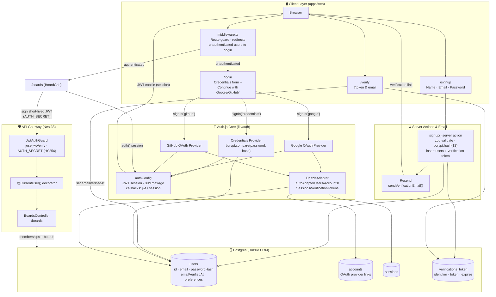

# CanvasFlow — Authentication System Design

## Flow summary

- **Credentials signup** → `signup()` server action validates input, hashes the
  password with bcrypt, inserts a `users` row (`emailVerifiedAt = null`), creates a
  `verifications_token` row, and emails a verify link via Resend.
- **Email verification** → `/verify` checks the token against `verifications_token`,
  sets `users.emailVerifiedAt`, and deletes the token.
- **Credentials login** → `Credentials` provider looks up the user by email and
  compares the bcrypt hash directly against `users.passwordHash`.
- **OAuth login (Google / GitHub)** → handled entirely by `DrizzleAdapter`, which maps
  Auth.js's expected `user`/`account`/`session`/`verificationToken` shapes onto this
  project's `users`/`accounts`/`sessions`/`verifications_token` tables via
  `authAdapterUsers`, `authAdapterAccounts`, `authAdapterSessions`,
  `authAdapterVerificationTokens`.
- **Session strategy** → JWT (no DB session lookups on each request); `jwt`/`session`
  callbacks copy `user.id` onto `token.id` / `session.user.id`.
- **Route protection** → `middleware.ts` allows `/`, `/login`, `/signup`, `/verify`,
  and `/api/auth/*`; everything else requires `req.auth` or redirects to `/login`.
- **Cross-service auth** → `boards.client.ts` signs a short-lived HS256 JWT with
  `AUTH_SECRET` containing `{ id, email, name }`; `api-gateway`'s `JwtAuthGuard`
  verifies it with the same secret and attaches `request.user`.
