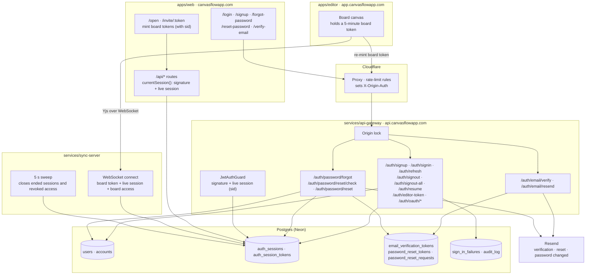

# CanvasFlow — Authentication System Design

The API gateway (`services/api-gateway`) owns every authentication decision:
creating accounts, checking passwords, signing in with Google or GitHub,
sessions, email verification and password recovery. The web app and the editor
are clients of it. They collect input and show state; they never decide who
somebody is.

```mermaid
flowchart TD
    subgraph EDGE["Cloudflare"]
        CF["Proxy · rate-limit rules\nsets X-Origin-Auth"]
    end

    subgraph WEB["apps/web · canvasflowapp.com"]
        PAGES["/login · /signup · /forgot-password\n/reset-password · /verify-email"]
        OPEN["/open · /invite/:token\nmint board tokens (with sid)"]
        WEBAPI["/api/* routes\ncurrentSession(): signature + live session"]
    end

    subgraph EDITOR["apps/editor · app.canvasflowapp.com"]
        CANVAS["Board canvas\nholds a 5-minute board token"]
    end

    subgraph GATEWAY["services/api-gateway · api.canvasflowapp.com"]
        LOCK["Origin lock"]
        AUTH["/auth/signup · /auth/signin · /auth/refresh\n/auth/signout · /auth/signout-all · /auth/resume\n/auth/editor-token · /auth/oauth/*"]
        EMAIL["/auth/email/verify · /auth/email/resend"]
        RESET["/auth/password/forgot\n/auth/password/reset/check · /auth/password/reset"]
        GUARD["JwtAuthGuard\nsignature + live session (sid)"]
    end

    subgraph SYNC["services/sync-server"]
        WS["WebSocket connect\nboard token + live session + board access"]
        SWEEP["5 s sweep\ncloses ended sessions and revoked access"]
    end

    subgraph DB["Postgres (Neon)"]
        T1[("users · accounts")]
        T2[("auth_sessions · auth_session_tokens")]
        T3[("email_verification_tokens\npassword_reset_tokens · password_reset_requests")]
        T4[("sign_in_failures · audit_log")]
    end

    RESEND["Resend\nverification · reset · password changed"]

    PAGES --> CF --> LOCK --> AUTH & EMAIL & RESET
    CANVAS -- "re-mint board token" --> CF
    CANVAS -- "Yjs over WebSocket" --> WS
    AUTH --> T1 & T2 & T4
    EMAIL --> T3
    RESET --> T1 & T2 & T3
    EMAIL & RESET --> RESEND
    GUARD --> T2
    OPEN --> WEBAPI --> T2
    WS --> T2
    SWEEP --> T2
```

## Credentials

| Credential                   | Where it lives                                  | Lifetime                                                            |
| ---------------------------- | ----------------------------------------------- | ------------------------------------------------------------------- |
| Access token (`cf.access`)   | HttpOnly cookie, path `/`, shared parent domain | 15 minutes. JWT naming the account (`sub`) and session (`sid`)      |
| Refresh token (`cf.refresh`) | HttpOnly cookie, path `/auth` only              | 30 days, sliding, capped at a year. Stored only as a SHA-256 digest |
| Board token                  | Editor memory and sessionStorage, per board     | 5 minutes. Board-scoped JWT; names the session for accounts         |
| Guest session (`cf.guest`)   | HttpOnly cookie on the web app                  | For people who joined a board by share link without an account      |

All three JWTs are HS256 over `AUTH_SECRET`, shared by the gateway, the web app
and the sync-server.

## Flows

- **Sign up** (`POST /auth/signup`): validates the password policy, hashes it
  with bcrypt (cost 12), creates the account unconfirmed, and emails a
  verification link. The browser then signs in straight away; an unconfirmed
  account can use its own boards but cannot share them.
- **Sign in** (`POST /auth/signin`): per-address failure limit first, then a
  case-insensitive lookup and a bcrypt check. A missing account, a wrong
  password, a provider-only account and a barred account all get the same
  answer in the same time (a decoy hash is checked when there is no account).
  Success creates an `auth_sessions` row and sets both cookies.
- **Google / GitHub** (`GET /auth/oauth/:provider`): the provider's confirmed
  address is linked to an existing account or creates one. An unconfirmed
  provider address is refused rather than linked.
- **Staying signed in**: the gateway renews the access token from the refresh
  cookie when it is close to expiring (`/auth/refresh`, `/auth/resume`,
  `/auth/editor-token`). Every renewal rotates the refresh token; presenting a
  spent one twice ends the session.
- **Email verification**: `POST /auth/email/verify` spends a single-use,
  30-minute link. `POST /auth/email/resend` sends a new one to the address on
  the account, never one from the request.
- **Forgot password** (`POST /auth/password/forgot`): answers `202` for every
  well-formed address, at the same speed. Looking the account up, issuing the
  link and sending the mail all happen after the reply. Password accounts get a
  link to `/reset-password#token=…` (the token is in the fragment, so it never
  reaches a server log); Google/GitHub-only accounts get a note saying how they
  sign in; guests, barred and unknown addresses get nothing.
- **Reset password** (`POST /auth/password/reset/check`, then
  `POST /auth/password/reset`): checking a link never spends it. Spending it
  checks the link before any bcrypt work, then one transaction sets the new
  password, confirms the address, cancels every other link and revokes every
  session. The owner is emailed that the password changed. There is no
  automatic sign-in afterwards.
- **Sign out** (`POST /auth/signout`, `POST /auth/signout-all`): revokes the
  session row (or every row) and clears the cookies.

## Ending a session takes effect immediately

A revoked session stops working on its very next request everywhere, not when
its token happens to expire:

- The gateway's `JwtAuthGuard` and session renewal check that the session named
  in the token (`sid`) is still live: one primary-key read.
- The web app's `currentSession()` and `currentUser()` do the same. The
  middleware only checks signatures, which is enough to decide whether to
  render a page.
- The sync-server refuses a connect whose session has ended, and its 5-second
  sweep closes any open connection whose session has ended, telling the editor
  `session-ended`. The editor then sends the person to sign in.

This covers every way a session ends: signing out, signing out everywhere, a
password reset, and a stolen refresh token being caught.

## Protections

- **Edge**: Cloudflare proxies the gateway, and the gateway refuses anything
  without the secret `X-Origin-Auth` header, so per-IP limits cannot be skipped
  by calling the origin directly. See [edge-protection.md](edge-protection.md).
- **Rate limits**: per IP in the gateway, and per address or per account in the
  database for sign-in failures, verification resends and reset requests.
- **Enumeration**: sign-in, forgot password and their rate limits answer the
  same for addresses with and without accounts.
- **Tokens at rest**: refresh tokens, verification links and reset links are
  256 random bits, stored only as SHA-256 digests, and spent by a conditional
  update so two requests cannot both use one.
- **Audit**: sign-ins, sign-outs, resets and revocations are written to
  `audit_log` without tokens, digests or addresses.

## Checking it

- `pnpm --filter @canvasflow/api-gateway verify:auth`: sign-in, rotation and
  rate limits against a running gateway.
- `pnpm --filter @canvasflow/api-gateway verify:password-reset`: forgot and
  reset, sessions and limits. Uses the forgot route's whole per-IP budget, so
  run it at most once every ten minutes.
- `pnpm --filter @canvasflow/e2e test:e2e --project=recovery`: the same flow
  through the real pages in a browser.
